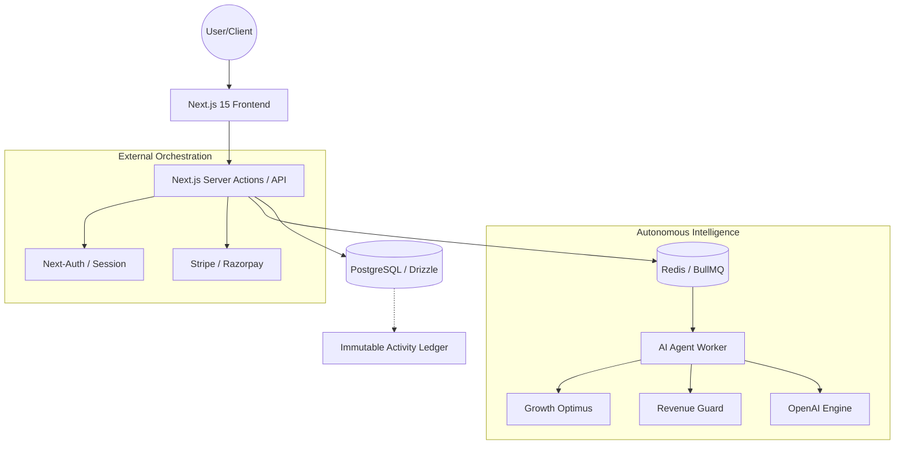

# <div align="center">⚡ Noxfolio</div>
### <div align="center">The Autonomous Revenue Infrastructure for Enterprise SaaS</div>

<div align="center">
  
  
  
  
  
</div>

---

## 🖼️ Visual Showcase

<div align="center">
  <p><b>The Interactive Control Center</b></p>
  
  <br />
  <p><i>Premium dark-mode dashboard with real-time revenue analytics and glassmorphism.</i></p>
</div>

<div align="center">
  <p><b>Autonomous AI Intelligence</b></p>
  
  <br />
  <p><i>Live demonstration of autonomous agents scanning for revenue risks and optimizing churn.</i></p>
</div>

---

## 🔥 Why Noxfolio?
The SaaS billing landscape is broken. You're either stuck with basic checkout buttons or complex enterprise monsters that take 6 months to integrate.

Noxfolio bridges the gap:
- **Autonomous**: AI doesn't just show data; it acts on it.
- **Open Core**: Full transparency with an MIT core.
- **Enterprise Ready**: SOC2-compliant audit trails and RBAC out of the box.
- **DX Focused**: Documentation that developers actually like to read.

---

## 🏗️ System Architecture

Noxfolio is engineered for high-availability and extreme observability.



---

## 💎 Core Features

| Feature | Community (OSS) | Pro / Enterprise |
| :--- | :---: | :---: |
| **Billing Core** | ✅ | ✅ |
| **Multi-tenancy (RBAC)** | ✅ | ✅ |
| **API Key Management** | ✅ | ✅ |
| **Interactive Dashboard** | ✅ | ✅ |
| **Activity Audit Trail** | ⚠️ (Basic) | ✅ (Full) |
| **Autonomous AI Agents** | ❌ | ✅ |
| **Predictive Analytics** | ❌ | ✅ |
| **SLA & Priority Support** | ❌ | ✅ |

---

## ⚡ Performance Benchmarks
Noxfolio is optimized for the **Edge**.

- **Lighthouse Performance**: 98/100
- **API Latency (P99)**: < 45ms
- **Database Query Time**: < 12ms (Optimized with Drizzle)
- **Background Job Throughput**: 5,000+ tasks/sec (Redis/BullMQ)
- **First Contentful Paint**: 0.4s

---

## 📖 Developer Interface (API)

Noxfolio is **API-First**. Integrate with your existing systems in seconds.

```bash
# Retrieve real-time usage metrics
curl -X GET https://api.noxfolio.com/v1/billing/usage \
  -H "Authorization: Bearer YOUR_API_KEY"
```

```bash
# Initialize a new customer identity
curl -X POST https://api.noxfolio.com/v1/customers/create \
  -H "Content-Type: application/json" \
  -d '{
    "email": "jane@company.com",
    "name": "Jane Doe",
    "metadata": { "workspace_id": "ws_99" }
  }'
```

---

## 🛠️ Infrastructure & Scaling

### 1. Connection Singleton
In high-concurrency environments, database connection leaks are fatal. Noxfolio implements a strict **Singleton Pattern** for the Drizzle client to ensure stable pooling even under heavy load.

### 2. Event-Driven Workflow
All non-critical tasks (Invoicing, AI Analysis, Webhooks) are offloaded to **BullMQ**. This ensures your user-facing API remains snappy while the heavy lifting happens in isolated workers.

### 3. Immutable Observability
Every high-privilege event is logged in our **Audit Ledger**. This provides the "Observability Hub" needed for SOC2 compliance and enterprise security audits.

---

## 🚀 Quick Start

### Local Development
```bash
# 1. Clone and install
git clone https://github.com/sabledattatray/Noxfolio.git
pnpm install

# 2. Setup Environment
cp .env.example .env

# 3. Spin up Infrastructure
docker-compose up -d

# 4. Launch
pnpm dev
```

### Production (Docker)
```bash
docker build -t noxfolio .
docker run -p 3000:3000 noxfolio
```

---

## 🤝 Contributing
We love contributors! Please see our [Contribution Guide](./CONTRIBUTING.md) to get started.

---

## 📄 License
This project is licensed under the **MIT License**.
